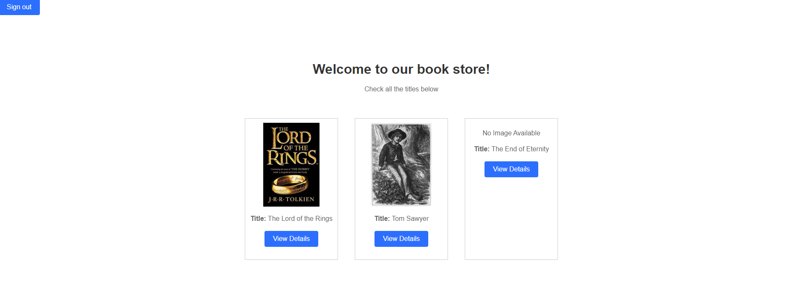

# Django custom user model

## Description
This Django project for TBC Academy represents a virtual book store. 
It includes a Start page, user registration and login options and a book library.

In addition to custom model for users, a book model is added in 'store' app.

To add books in database, a user must have admin privileges.
Soon I may add a feature that will automatically store sample books in DB.

Plus, now there's a 'media/images' directories that stores book images when they are added to a database.
The database itself holds a reference to those images.
- 'Djangos_book_store' is the project folder.
- 'users' is an app handling user signup and login processes.
- 'store' app handles the virtual library.
- For respective pages I have used simple HTML templates located in 'templates' folder.

## Usage
A user on home page sees Two options for registration or login.

In this version a user must log in to access book store, but I plan to remove this requirement shortly.


After login user will see a store home page with all available books displayed:



Each book has option to display more details as shown below:


## Requirements
- Python 3.12

To install other requirements run in terminal:
````
pip install -r requirements.txt
````

