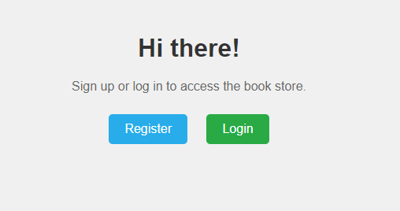
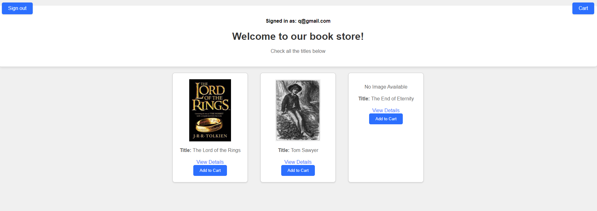
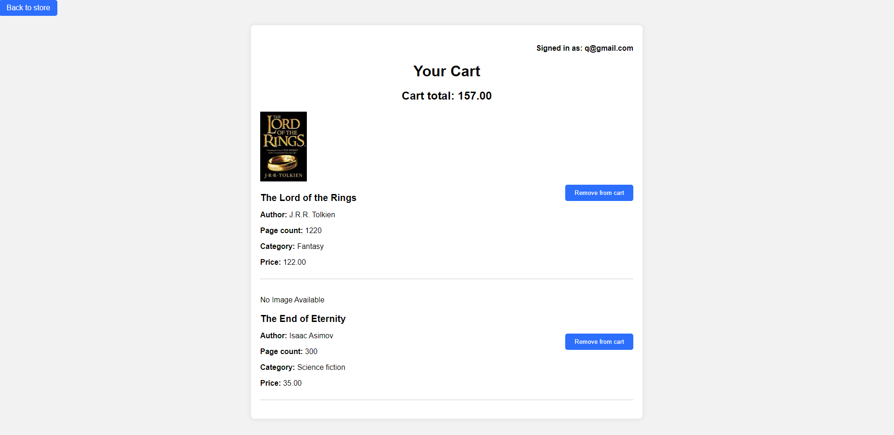

# Django's book store

## Description
- This Django project for TBC Academy represents a virtual book store. 
It includes a Start page, user registration and login options and a book library, including a cart where user can add
or remove a book.
- For testing purposes to add books in a database, a user must have admin privileges.
- The 'media/images' directory that stores book images when they are added to a database.
The database itself holds only references to actual images.

Other things to note:
- 'Djangos_book_store' is the project folder.
- 'users' is an app handling user signup and login processes.
- 'store' app handles the virtual library.
- For respective pages I have used simple HTML templates located in 'templates' folder.

## Usage
Clone the repo in your local machine and go to the project. Then run in terminal:
````
python manage.py migrate
````
Then create superuser using:
````
python manage.py createsuperuser
````
Run server with:
````
python manage.py runserver
````
and access admin page on - http://127.0.0.1:8000/admin to add books in the store.
******
After adding few sample books to store go back to http://127.0.0.1:8000 

Here user on home page sees Two options for registration or login.

In this version a user must log in to access book store (I plan to remove this requirement shortly).



After login user will see a store home page with all available books displayed:



Each book has option to display more details, as well as 
an option to add to cart as shown below:



## Requirements
- Python 3.12

To install other requirements run in terminal:
````
pip install -r requirements.txt
````


